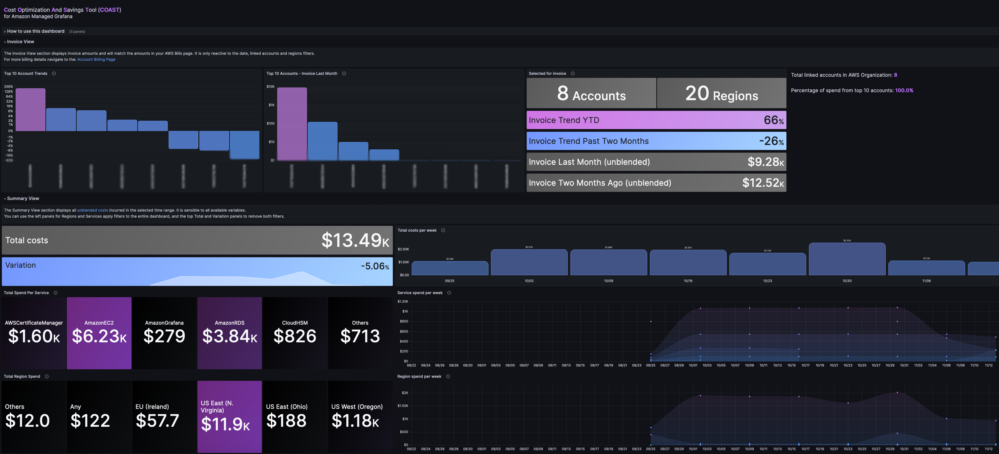

# COAST - Cost Optimization and Saving Toolkit for Amazon Managed Grafana

## About

COAST is an open-source infrastructure as code deployment solution that integrates with Amazon Managed Grafana to provide customers with cost intelligence and optimization dashboards. COAST helps customers analyze and optimize their cloud costs by providing them with customizable dashboards on the Grafana open-source analytics and monitoring application they are already familiar with. With COAST, customers can gain full visibility and control over their cloud costs, ensuring that they are optimizing their spend and maximizing their ROI.

###### Advantages of COAST
- If you are already using Grafana for monitoring application metrics, you will be familiar with the tool inferface.
- COAST will integrate nicely with your existing Grafana dashboards.
- COAST has support for filtering by AWS account, service and AWS tags.
- COAST may be installed at the AWS Management Account (payer) or in a single linked account with [member CUR](https://aws.amazon.com/about-aws/whats-new/2020/12/cost-and-usage-report-now-available-to-member-linked-accounts/).
- COAST deploys the Executive dashboard with a CloudFormation template in under 5 minutes, and [additional dashboards](https://github.com/aws-samples/COAST/tree/main/grafana_dashboards) may be added with Grafana's easy one click [import](https://grafana.com/docs/grafana/latest/dashboards/manage-dashboards/#export-and-import-dashboards).

## Pre-requisites

- AWS IAM Identity Center - [Amazon Managed Grafana requires authentication](https://docs.aws.amazon.com/grafana/latest/userguide/authentication-in-AMG.html).  Our CloudFormation template configures the Grafana workspace with [AWS SSO](https://docs.aws.amazon.com/singlesignon/latest/userguide/getting-started.html).

## Suggested Configuration
The COAST CloudFormation deployment template supports both deploying with an existing [Cost and Usage Report (CUR)](https://docs.aws.amazon.com/cur/latest/userguide/what-is-cur.html) or creating a new one if none exists. For immediate utilization of the COAST dashboard, it is recommended to have an already enabled Cost and Usage Report (CUR). If CUR is enabled during COAST deployment, dashboards may not display data for approximately 24 hours, and historical data will be unavailable unless a backfill is requested from AWS. 

## Cloud Formation Template Deployment

### Setup Overview

The setup process will create the following resources, along with their dependencies:

- A new AWS Cost and Usage Report (AWS CUR)
  - If an existing report is provided, the system will use the provided one.
- Glue and Lambda infrastructure to update the Athena database
- An Amazon Athena database for the Cost and Usage Report
- Least Privilege Access Roles to allow the Cost and Usage Report to update Athena
- An Amazon Managed Grafana workspace
- A Grafana Athena Data Source (with AWS IAM Identity Center as the identity provider)
- Importation of the Grafana Executive Dashboard

### Deploy with CloudFormation
- In CloudFormation, select Create Stack and select 'Upload a template file'.  Download and use the template cloudformation/COAST-cfn.yaml.  
- Enter a Stack name.
- For the parameters section follow the guidance below on enabling the dashboards with an existing CUR or a new CUR.
- On the next screen, we suggest adding tags to your deployment.
- On the last screen check 'I acknowledge that AWS CloudFormation might create IAM resources with custom names.' and click 'Submit'.

### CUR report Overview
Within the CloudFormation template, you can choose whether to create a new Cost and Usage Report (CUR) or utilize an existing one by providing its name. The template will establish the necessary infrastructure to update the Grafana datasource (Athena) with CUR data. For additional information on the CUR/Athena integration, refer to the documentatio [here](https://docs.aws.amazon.com/cur/latest/userguide/use-athena-cf.html).  

  #### Create New CUR
  Opting for this choice will initiate the creation of a new Cost and Usage Report (CUR) along with the necessary infrastructure to populate the Athena database with CUR data. Please be aware that it will take a minimum of 24 hours for the new CUR to be populated with data.  Historical data will be unavailable unless a backfill is requested from AWS Support.

  To implement this in CloudFormation:

  - Launch a new stack using the cloudformation/COAST-cfn.yaml template.
  - Do not modify the CurReportName parameter in the template
  - The template will generate a report name based on the CloudFormation (CFN) stack name.
  - Similarly, an S3 data bucket will be named and created based on the CFN stack name.

  #### Use Existing CUR
  Opt for this configuration only if you already possess a Cost and Usage Report (CUR) and wish to have Grafana utilize that existing CUR as the datasource. This choice will leverage your current CUR while establishing the necessary infrastructure to populate the Athena database with the CUR data.

  To implement this in CloudFormation:

  - Ensure the CUR bucket of your existing CUR report is located in the same region as this CloudFormation stack (refer to the same region note in the documentation).
  - Launch a new stack using the cloudformation/COAST-cfn.yaml template.
  - Enter the name of your existing CUR in the CurReportName field.
  - We will determine the S3 bucket used with the existing CUR report and use this bucket while establishing the necessary infrastructure.

### Post Installation Steps
- Grafana workspaces require an identity provider (IdP) to enable users to log in to the workspace.
- We recommend AWS IAM Identity Center (the Cloudformation template creates the Grafana workspace with AWS IAM Identity Center enabled).  
- Add at least one Admin user under the Authentication tab in the Grafana Workspace console.  For additional instructions, see the [Grafana User Guide](https://docs.aws.amazon.com/grafana/latest/userguide/AMG-manage-users-and-groups-AMG.html) to setup user access.
- Login to the COAST Grafana workspace URL using the identity configured above.
- The dashboard will be automatically imported under the General folder in the Dashboards menu

  #### Importing Additional Dashboards

  You can import extra dashboards available in the grafana_dashboards folder of this repository. When importing dashboards, initially set all top variables to 'All'. This ensures that no variables (such as tags) are filtered in your initial view.
  
  ##### FinOps Dashboard

  This dashboard is recommended for FinOps practitioners. It displays a billing overview, a summary of spend trends, region activity, and visuals for purchase types. To utilize this dashboard, your Cost and Usage Report (CUR) data should include reserved instance and savings plans columns. Additionally, you need to have at least one cost allocation tag enabled.
  
  ##### Executive Dashboard

  Designed for company leadership, this dashboard offers a view of billing and overall spend trends. To use this dashboard, your CUR data should include reserved instance and savings plans columns. Additionally, at least one cost allocation tag must be enabled.
  
  ##### Engineering Dashboard

  This dashboard is recommended for engineering teams. Teams can filter based on cost allocation tags and display only the services relevant to them. To utilize this dashboard, your CUR data should include reserved instance and savings plans columns. Additionally, you need to have at least one cost allocation tag enabled.

## Associated Cost
COAST is an open-source solution and is completely free to use. However, you will be responsible for any AWS costs associated with underlying AWS services.

## Support
COAST is supported by Solution Architects of AWS on best effort basis. However, users are encouraged to ask questions, open issues, contribute and provide feedback.

## Contributing
The core team for COAST include the following, in alphabetical order:

- Chris Strzelczyk
- Lucas Vieira
- Munish Dabra
- Siva Guruvareddiar

However, we welcome the wider open-source community to this project. See [CONTRIBUTING](https://github.com/aws-samples/COAST/blob/main/CONTRIBUTING.md) for more information.

## License
This library is licensed under the MIT-0 License. See the [LICENSE](https://github.com/aws-samples/COAST/blob/main/LICENSE) file.
