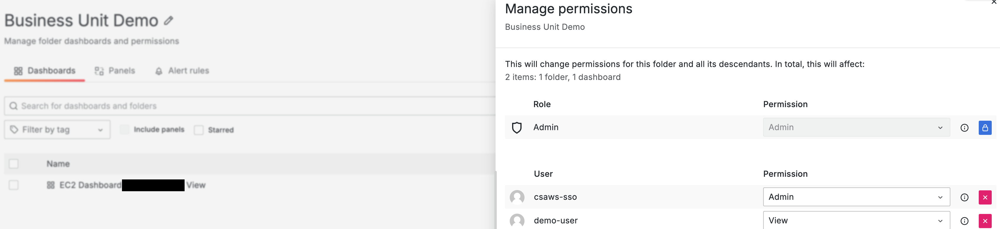
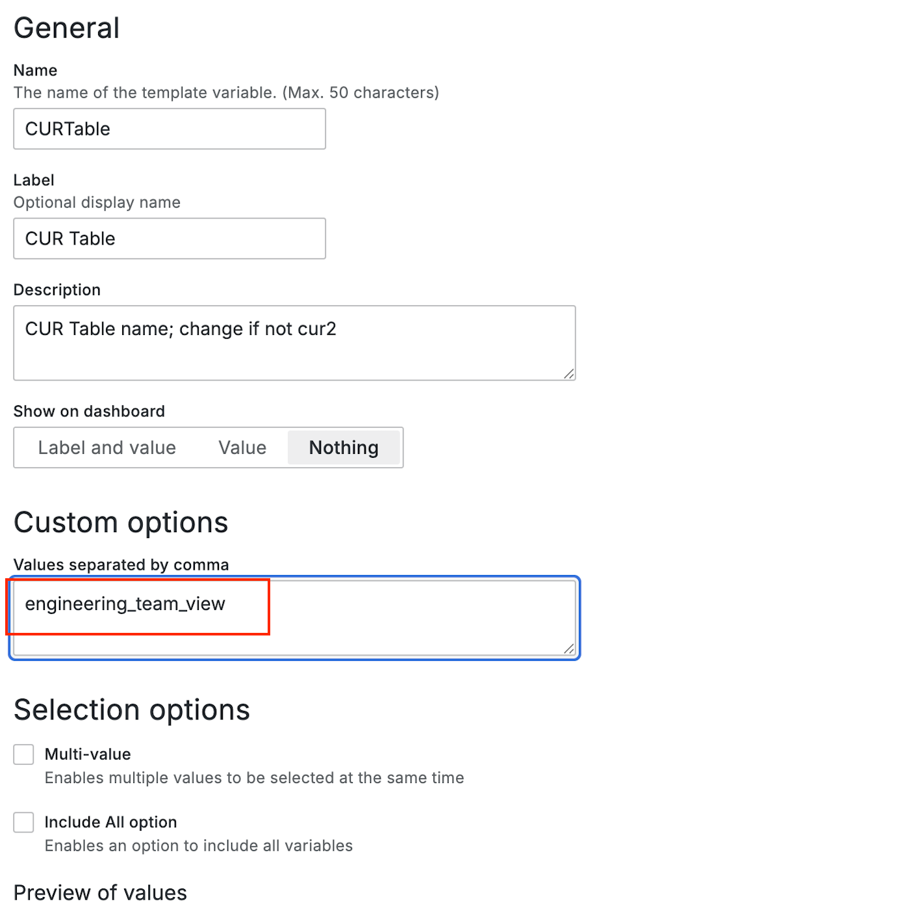
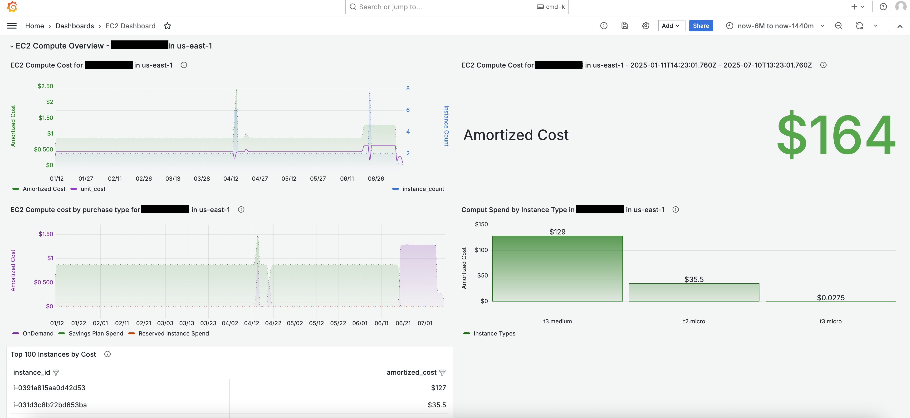
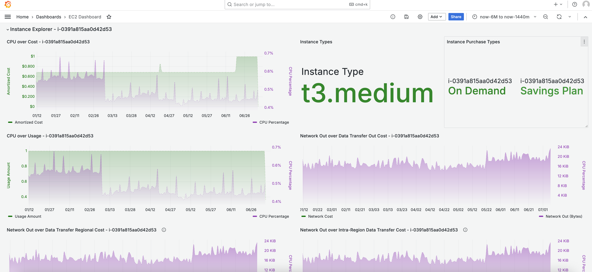
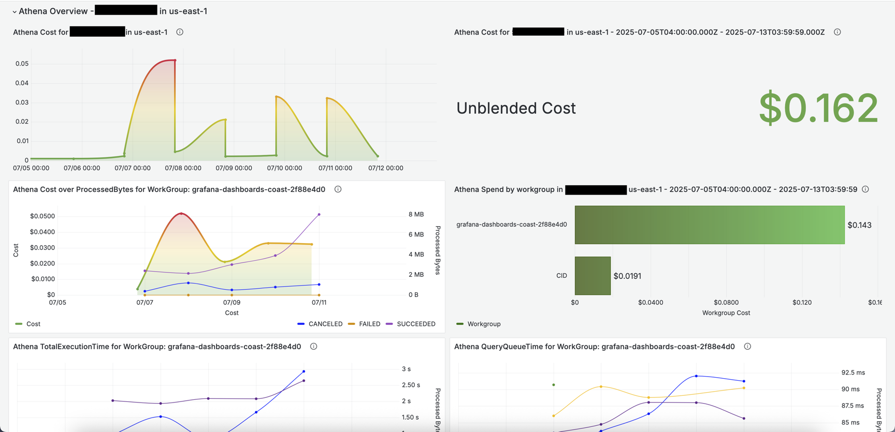
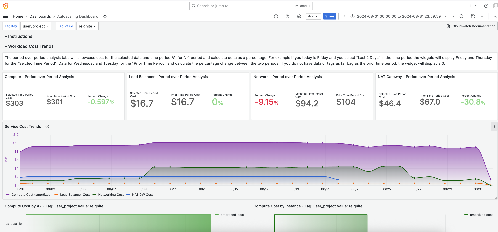
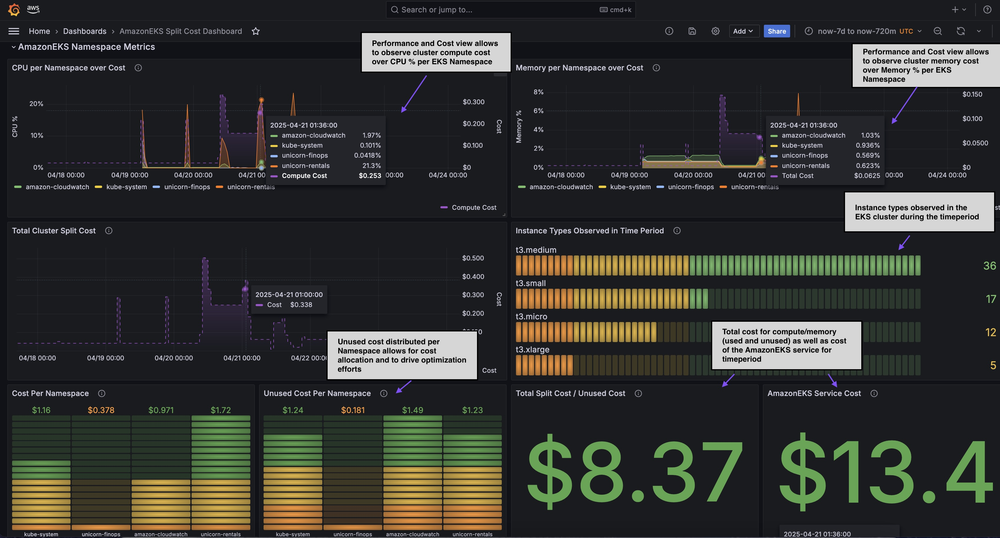

<div align="center">

<h1 align="center">COAST</h1>
<h5 align="center">Cost Dashboards for Engineers</h5>


<a href="#introduction">Introduction</a> &nbsp;&bull;&nbsp;
<a href="#installation">Installation</a> &nbsp;&bull;&nbsp;
<a href="#documentation">Documentation</a> &nbsp;&bull;&nbsp;
<a href="#dashboards">Dashboards</a> &nbsp;&bull;&nbsp;
<a href="#issue">Issue?</a>

</div>

### Introduction
---

COAST is an open-source collection of Grafana dashboards that provide the capability to combine and observe AWS resource performance metrics with AWS cost and usage report (CUR) data. These dashboards assist customers in promoting financial accountability, optimizing costs, tracking usage goals, implementing governance best practices, and achieving operational excellence across all Well-Architected pillars. Utilizing Amazon Managed Grafana allows us to use an open-source platform that is very popular with the engineering community.

**THIS IS A BETA PROJECT.  Please be sure to monitor and observe costs closely for the serivces that this project utilizes.**. Services used by this project include Amazon Managed Grafana, Amazon CloudWatch, Amazon Athena, Amazon Glue, and Amazon S3.

###### Advantages of COAST

- If you are already using Grafana for monitoring application metrics, you will be familiar with the tool interface.
- COAST dashboards may integrate with your existing Grafana deployments.
- COAST dashboards support filtering on multiple dimensions, including account and region.

###### Amazon Managed Grafana

COAST is deployed via CloudFormation, which allows for the provisioning of [Amazon Managed Grafana](https://aws.amazon.com/grafana/) and supporting resources and policies. The dashboards themselves are json based files which may be imported on EC2-based Grafana deployments; however, the configuration of data sources, plugins and supporting roles and policies would be manual. 

### Installation
---

##### 1. CUR Data Preparation.

We recommend deploying dashboards in a **dedicated monitoring** account to aggregate Cost and Usage Report (CUR) data and CloudWatch cross-account metrics. This separation from the payer management account enhances security by consolidating observability functions in a tightly controlled environment. To deploy the COAST Grafana dashboard infrastructure, we recommend utilizing the data collection engine of the **Cloud Intelligence Dashboards (CID)**.  CID has built an architecture and deployment for central CUR and FOCUS aggregation utilized for the CID Dashboards. 

The CID Data Collection Lab provides CloudFormation templates to copy CUR 2.0 data from your Management (Payer) Account to a dedicated one. You can use it to aggregate data from multiple Management Accounts or multiple Linked Accounts.  

[Step 1: Create Desitination for CUR Aggregattion](https://docs.aws.amazon.com/guidance/latest/cloud-intelligence-dashboards/deployment-in-global-regions.html#deploy-in-global-regions-create-cur-and-replication) in your dedicated Data Collection Account.

[Step 2: Create CUR 2.0 and replication](https://catalog.workshops.aws/awscid/en-US/dashboards/foundational/cudos-cid-kpi/deploy#step-2.-in-managementpayersource-account-create-cur-2.0-and-replication) in the Management Account.

*Step 3 may be ignored.*

##### 2. Metrics Configuration.

Most dashboards will have a requirement of CloudWatch metrics to visualize performance metrics. As a best practice, we recommend the configuration of **CloudWatch cross-account observability** into the central monitoring account (data collection account).  Each account (source account) that you wish to collect CloudWatch metrics from will need to configure each region to send metrics to the monitoring account (data collection account).

In the data collection account, in the CloudWatch settings, Select *Configure* under *Monitoring account configuration*.  Select *Logs* and *Metrics* as the data selection, and fill in a comma separated list of accounts under *List source accounts* (note there is a process for collecting metrics from the entire Organization, see the CloudWatch instructions in the link above).  You will need to copy the *Monitoring accounts sink ARN* of the data collection account in each region.  This information is available under the *Configuration details* of the CloudWatch *Monitoring account configuration*.

In each source account in each region, in the CloudWatch settings, select *Source account configuration*.  Select *Logs* and *Metrics* as the data.  Paste in the *Sink ARN* from the data collection account (from the same region).  Then select *Account name* as the identifier.  

For more in-depth instructions, see [Configure CloudWatch cross-account observability](https://docs.aws.amazon.com/AmazonCloudWatch/latest/monitoring/CloudWatch-Unified-Cross-Account.html). 

##### 3. Solution Deployment. 

Deploy COAST within the central monitoring account (data collection account). The COAST CloudFormation template builds the Amazon Grafana Workspace, installs the Athena plugin, and configures the Athena plugin with the deployed CUR and CloudWatch.

[Provision COAST](cloudformation/provision-coast-services.yaml)

### Documentation
---

###### Post Installation Steps
- Grafana workspaces require an identity provider (IdP) to enable users to log in to the workspace.
- We recommend AWS IAM Identity Center (the CloudFormation template creates the Grafana workspace with AWS IAM Identity Center enabled). 
- Add at least one Admin user under the Authentication tab in the Grafana Workspace console.  For additional instructions, see the [Grafana User Guide](https://docs.aws.amazon.com/grafana/latest/userguide/AMG-manage-users-and-groups-AMG.html) to setup user access.
- Login to the COAST Grafana workspace URL using the identity configured above.
- Import the dashboards you require as per the instructions below

###### Importing Dashboards

You may now import dashboards available in the grafana_dashboards folder of this repository. Select a dashboard to import. This will populate the dashboard name and UID.

- Currently, all dashboards are based on CUR 2.0 and will require an Athena datasource connected to CUR
- Most dashboards will leverage CloudWatch as a metrics data source
- Some dashboards will require additional configuration (i.e., CloudWatch Container Insights for the AmazonEKS dashboards). These installation steps will be specified in the README file within the dashboard folder

After importing the dashboards, follow the dashboard's readme file to set your variables and understand the data visualizations.

######  Associated Cost

> [!IMPORTANT]
> Costs are associated with operating this dashboard.  Costs depend on usage and the size of your datasets, be sure to get a complete understanding of costs before deployment. 

COAST is an open-source solution and is completely free to use. However, you will be responsible for any AWS costs associated with underlying AWS services. Costs to consider:

[Amazon Managed Grafana Pricing](https://aws.amazon.com/grafana/pricing/)

[CloudWatch Grafana Plugin Cost](https://grafana.com/docs/grafana/latest/datasources/aws-cloudwatch/#control-pricing)

Each dashboard may have additional cost implications. Details are provided in the README file associated with each dashboard.  Consider that the more queries you have in a dashboard, and the longer the lookback period will result in a larger data pull from Athena which will impact cost.

### Split CUR per Business Unit

You may with to import dashboards which allow access to only a small subset of the accounts from your CUR.  Common use cases are to allows individual business units to see their data only.  This is possible with the combination of views in Athena and Grafana permissions management.

1. Create a view in the data collection account Athena which only contains cost and usage data for a subset of accounts. 

    ```
    CREATE OR REPLACE VIEW "engineering_team_view" AS 
    SELECT *
    FROM
    cid_data_export.cur2
    WHERE (line_item_usage_account_id IN ('111222333444', '222333444555'))
    ```
    <br><br>

2. Import the dashboard under this folder, and make sure the permissions do not override that of the parent folder.  On the folder adjust the permissions to only allow the appropriate users or teams to access this dashboard as viewers.  In this case,  demo-user has viewer access.  The demo-user account will only be able to view dashboards under this folder and not view dashboards in other folders.     

    <br><br>


3. In the imported dashboard(s), adjust the CURTable variable so that it is pointing at the newly created view, in this example 'engineering_team_view'.

    <br><br>

4. The dashboard will now display only the accounts within the view.

### Dashboards
---

###### Amazon EC2 Dashboard

The EC2 Instance Dashboard displays EC2 instance compute cost, usage and performance metric information filtered by account and region. One section also filters by tag. The filter panel will refresh based on selections of previous filters. For example, when an account is selected the Region menu will only show regions, instances and tags observed in that account for the time period selected.

[AmazonEC2 Dashboard](grafana_dashboards/cur2/ec2_dashboard/README.md)


<br>


##### Athena Dashboard

The Athena Dashboard displays Amazon Athena cost over CloudWatch metrics such as ProcessedBytes or TotalExecutionTime. Usage and performance metric information is filtered by account and region. One section also filters by tag. The filter panel will refresh based on selections of previous filters. For example, when an account is selected the Region menu will only show regions, workgroups and tags observed in that account for the time period selected.

[Athena Dashboard](grafana_dashboards/cur2/athena_dashboard/README.md)



###### Auto Scaling Dashboard

The Auto scaling dashboard provides comprehensive visibility into your Auto scaling workloads, organized by Auto scaling group name and tag/key values. Built on the CUR 2 format, it requires both CUR 2 and CloudWatch data sources. The dashboard consolidates autoscaling workload resources, enabling you to monitor both cost and performance metrics in a single unified view.

[Athena Dashboard](grafana_dashboards/cur2/auto_scaling_dashboard/README.md)



###### Amazon EKS Split Cost Dashboard

The AmazonEKS Split Cost Allocation Dashboard combines the split cost allocation data available within the cost and usage (CUR) report and marries the data with CloudWatch performance metrics to graph performance metrics over cost. The Amazon EKS Split Cost Allocation Dashboard is crucial for engineers as it provides a unified view of cost and performance metrics, enabling them to make informed decisions, optimize resource usage, and ensure efficient cloud operations.

[AmazonEKS Split Cost Dashboard](grafana_dashboards/cur2/amazoneks_dashboard/README.md)



### Issues
---

COAST is supported by Technical Account Managers and Solution Architects of AWS on a best-effort basis. However, users are encouraged to open Github issues, ask questions, contribute, and provide feedback.

### Contribution
---

The core team for COAST include the following, in alphabetical order:

- Chris Strzelczyk
- Lucas Vieira
- Munish Dabra
- Siva Guruvareddiar

However, we welcome the wider open-source community to this project. See [CONTRIBUTING](https://github.com/aws-samples/COAST/blob/main/CONTRIBUTING.md) for more information.

### License
---

This library is licensed under the MIT-0 License. See the [LICENSE](https://github.com/aws-samples/COAST/blob/main/LICENSE) file.
