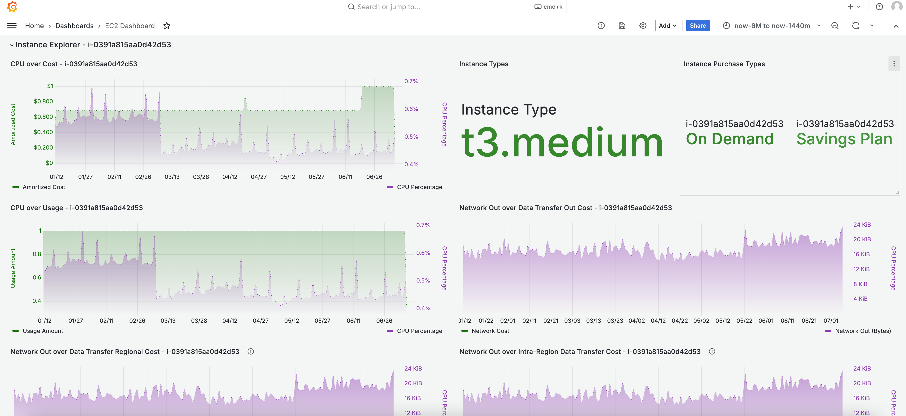

# AmazonEC2 Dashboard

<a href="../../README.md">Project Home</a> &nbsp;&bull;&nbsp;
<a href="#introduction">Introduction</a> &nbsp;&bull;&nbsp;
<a href="#installation">Installation</a> &nbsp;&bull;&nbsp;
<a href="#documentation">Documentation</a> &nbsp;&bull;&nbsp;
<a href="#license">License</a>

### Introduction
---

The Athena Dashboard displays Amazon Athena cost, usage and performance metric information filtered by account and region. One section also filters by tag. The filter panel will refresh based on selections of previous filters. For example, when an account is selected the Region menu will only show regions, workgroups and tags observed in that account for the time period selected.

CloudWatch metrics are available in certain graphs where a common key can be defined between CUR data and CloudWatch data (i.e. workgroup name). For metrics to work correctly, you need the CloudWatch data source enabled. For CloudWatch cross-account/cross-region to work correctly you need to have CloudWatch (cross-account) metrics configured. 

 

### Installation
---

##### Step 1.

This dashboard requires CUR 2.0 and assumes you have installed the CID Datacollection stack per the instructions in the project README file.  Once configured, be sure to adjust CURDatabase and CURTable variables if you have changed your Athena database and table names.

##### Step 2.

Some visuals in this dashboard require a CloudWatch datasource and **CloudWatch cross-account observability**.  It is assumed you have installed the CloudWatch datasource per the instructions in the project Readme file.

##### Step 2. 

Under the Grafana Dashboard menu select New -> Import.  Next select your Athena and CloudWatch datasources.

### Documentation
---

This dashboard has two sections.

##### Overview Section
A general overview of Athena Spend and associated CloudWatch metrics.
    
##### Tag Explorer
A collection of visuals displaying Cost and Usage grouped by the selected Tag and Value (CloudWatch is not supported with tagging)

######  Associated Cost
> [!IMPORTANT]
> Costs are associated with operating this dashboard.  Costs depend on usage and the size of your datasets, be sure to get a complete understanding of costs before deployment. 

[CloudWatch Pricing](https://aws.amazon.com/cloudwatch/pricing/)

Additional costs have been outlined in the [project README](../../README.md)

### License
---
This library is licensed under the MIT-0 License. See the [LICENSE](https://github.com/aws-samples/COAST/blob/main/LICENSE) file.
