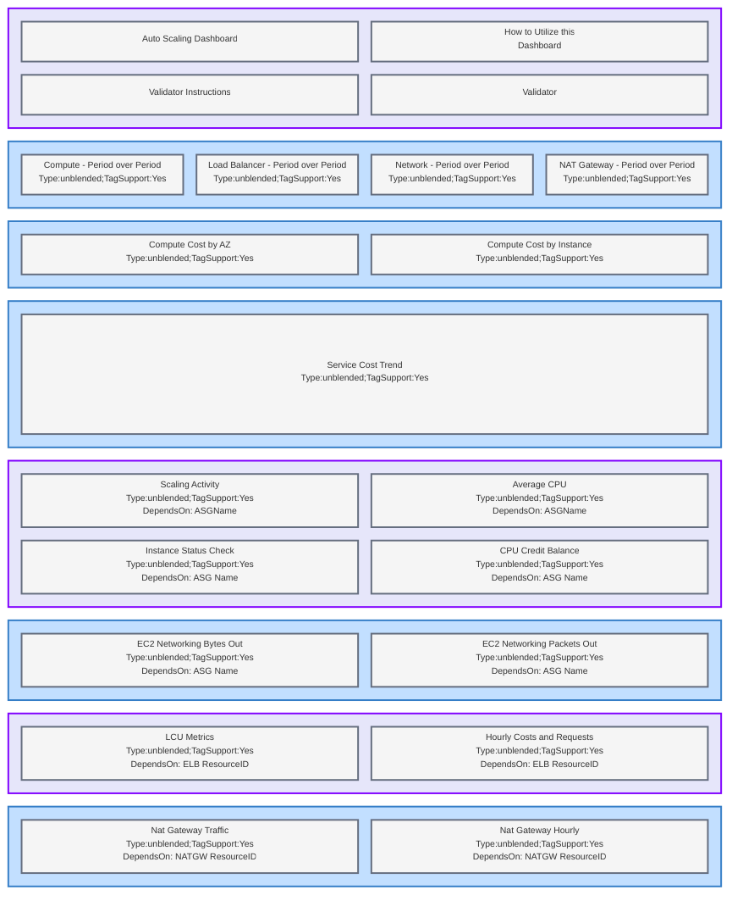

# Autoscaling Dashboard

## About

The COAST Autoscaling Dashboard provides a comprehensive overview of cost and infrastructure performance metrics related to EC2 Autoscaling Groups, Load Balancers, NAT Gateways, and networking across all associated resources. The data sources feeding into this dashboard are CloudWatch and the Cost and Usage Report (CUR).

To effectively utilize this dashboard, it necessitates the specification of your autoscaling group's name. Moreover, all resources within your autoscaling workload must be tagged with a unique tag key/value pair specific to this workload. It is imperative that these tags are enabled as Cost Allocation Tags and persist within the Cost and Usage Report (CUR).

## Usage
All panels within the Autoscaling Dashboard require cost allocation tags to exist within your CUR.  First select the region where or the workload.  Next, you will need to fill in the name of the autoscaling group you wish to monitor, the cost of the autoscaling group will be displayed with by selecting the accompaning tag for the autoscaling group and all of it's resources, and supporting resources (i.e. LB, NATGW).   

The values for the NAT Gateway and Load Balancer menus will populate based on your selection for tags.  Additional graphs will be selected once one or more NATGW's or LB's are selected. 

## Limitations 

Currently the COAST Autoscaling Dashboard is in a proof of concept phase.  It has been certified for workloads which are operating in the same account same region as the COAST deployment.  We are working to make the COAST Autoscaling Dashboard operational across regions and across accounts.

## Layout
Type: [unblended|amortized] - how are the costs displated unblended or amortized
TagSupport: [Yes|No] -  If the panel requires tags
DependsOn: If the panel depends on any menu selection items

## Troubleshooting

#####Autoscaling Metrics
If you are not seeing Autoscaling Metrics in Cloudwatch, make sure to enable 'Auto Scaling group metrics collection' under the monitoring tab in your Autoscaling Group console.

