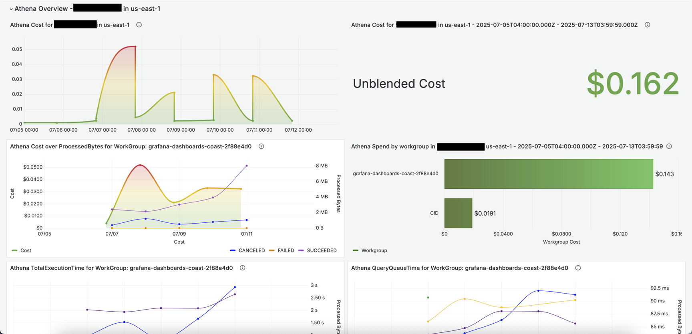
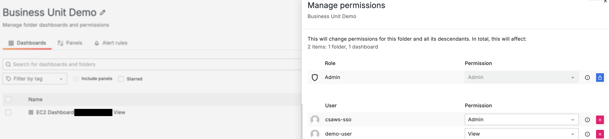
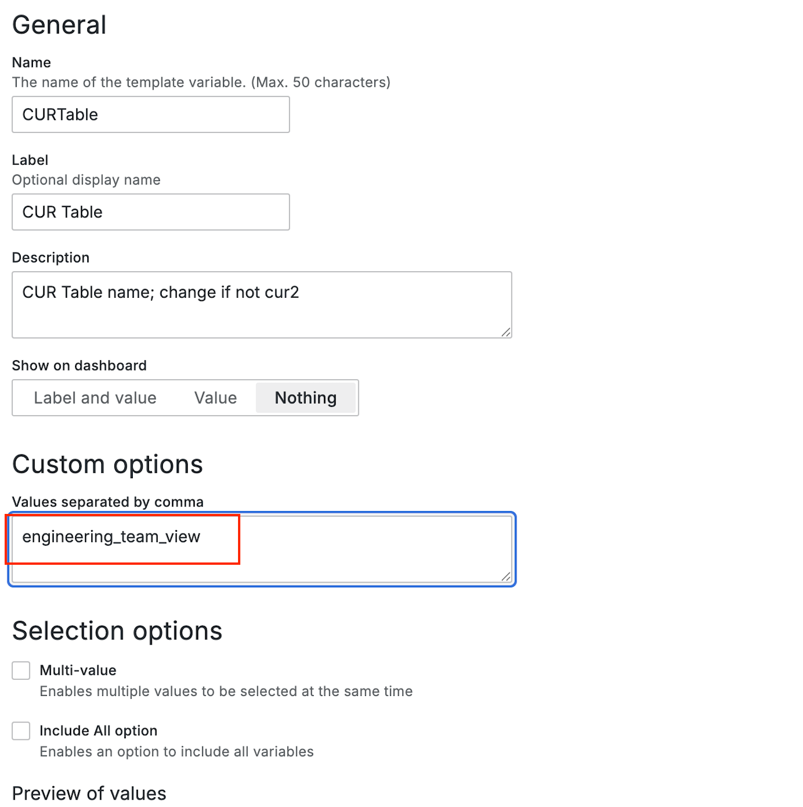

# Autoscaling Dashboard

<p align="center">


</p>

<p align="center">
<a href="../../README.md">Project Home</a> &nbsp;&bull;&nbsp;
<a href="#introduction">Introduction</a> &nbsp;&bull;&nbsp;
<a href="#installation">Installation</a> &nbsp;&bull;&nbsp;
<a href="#documentation">Documentation</a> &nbsp;&bull;&nbsp;
<a href="#license">License</a>
</p>

### Introduction
---

**THIS IS A BETA PROJECT.  Please be sure to monitor and observe costs closely for the serivces that this project utilizes.**.

The Auto Scaling Dashboard provides a comprehensive overview of cost and infrastructure performance metrics related to EC2 Auto Scaling Groups, Load Balancers, NAT Gateways, and networking across all associated resources. The data sources feeding into this dashboard are CloudWatch and the Cost and Usage Report (CUR).

To effectively utilize this dashboard, it necessitates the specification of your autoscaling group's name. Moreover, all resources within your autoscaling workload must be tagged with a unique tag key/value pair specific to this workload. It is imperative that these tags are enabled as Cost Allocation Tags and persist within the Cost and Usage Report (CUR).

<br>


### Installation
---

##### Step 1.

This dashboard requires CUR 2.0 and assumes you have installed the CID Datacollection stack per the instructions in the project README file.  Once configured, be sure to adjust CURDatabase and CURTable variables if you have changed your Athena database and table names.  We default to the CUR Table named cur2.

##### Step 2.

Some visuals in this dashboard require a CloudWatch datasource and **CloudWatch cross-account observability**.  It is assumed you have installed the CloudWatch datasource per the instructions in the project Readme file.

##### Step 2. 

Under the Grafana Dashboard menu select New -> Import.  Next select your Athena and CloudWatch datasources.

### Documentation
---

This dashboard has two sections.

##### Overview Section
A general overview of Athena Spend and associated CloudWatch metrics.
    
##### Tag Explorer
A collection of visuals displaying Cost and Usage grouped by the selected Tag and Value (CloudWatch is not supported with tagging)


######  Associated Cost
> [!IMPORTANT]
> Costs are associated with operating this dashboard.  Costs depend on usage and the size of your datasets, be sure to get a complete understanding of costs before deployment. 

[CloudWatch Pricing](https://aws.amazon.com/cloudwatch/pricing/)

Additional costs have been outlined in the [project README](../../README.md)

######  Splitting CUR per Business Unit

Many customers will require to deliver a dashboard to a business unit which owns only a small subset of accounts under the management account.  This goal may be accomplished by utilizing Athena views and Grafana permissions.  

1. Create a view which includes only the accounts necessary for the business unit

    The below example shows an example based on cur2:

    ```
    CREATE OR REPLACE VIEW "engineering_team_view" AS 
    SELECT *
    FROM
    cid_data_export.cur2
    WHERE (line_item_usage_account_id IN ('111222333444', '555666777888'))
    ```

2. Create a folder for the business unit, and grant view permissions down to the user(s), teams or roles.  In the example below demo-user has the ability to view dashboards in this folder.  Other dashboads in Grafana forbid demo-user from gaining viewing their content. 

    <br>

3. Next for all dashboards in the folder, adjust their CURTable variable to point to the newly created view 'engineering_team_view':

    <br>

### License
---
This library is licensed under the MIT-0 License. See the [LICENSE](https://github.com/aws-samples/COAST/blob/main/LICENSE) file.

## Troubleshooting

#####Autoscaling Metrics
If you are not seeing Autoscaling Metrics in Cloudwatch, make sure to enable 'Auto Scaling group metrics collection' under the monitoring tab in your Autoscaling Group console.