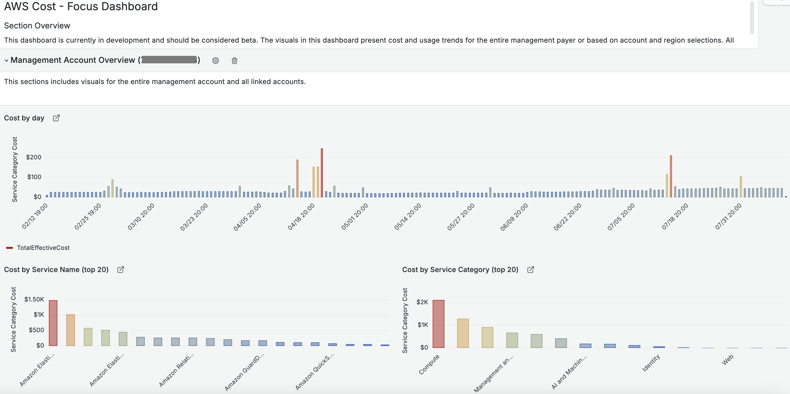

# Focus Cost and Usage Overview Dashboard

<a href="../../README.md">Project Home</a> &nbsp;&bull;&nbsp;
<a href="#introduction">Introduction</a> &nbsp;&bull;&nbsp;
<a href="#installation">Installation</a> &nbsp;&bull;&nbsp;
<a href="#documentation">Documentation</a> &nbsp;&bull;&nbsp;
<a href="#license">License</a>

### Introduction
---

**THIS IS A BETA PROJECT.  Please be sure to monitor and observe costs closely for the serivces that this project utilizes.**.

The FOCUS Cost and Usage Overview dashboard aims to provide an example of observing cost and usage utilizing the [AWS implementation of the FinOps.org FOCUS specification](https://docs.aws.amazon.com/cur/latest/userguide/table-dictionary-focus-1-0-aws.html).  The dashboard provides two sections.  A high level overview of spend trends across all accounts and an account/region specific section to observe cost per account in a specific region. 

More information on the FOCUS specification is available at the [focus.finops.org](https://focus.finops.org/).

 
<!-- 
 -->

### Installation
---

##### Step 1.

This dashboard requires the FOCUS dataset and assumes you have installed the CID Datacollection stack per the instructions in the project Readme file.  Once configured, be sure to adjust CURDatabase and CURTable variables if you have changed your Athena database and table name.

##### Step 2. 

Under the Grafana Dashboard menu select New -> Import.  Next select your Athena datasource.

### Documentation
---

This dashboard has two sections.

##### Management Account Overview Section
A general overview of management and all linked account cost trends.
    
##### Account/Region Analysis
A per account per region analysis of cost trends. 

######  Associated Cost
> [!IMPORTANT]
> Costs are associated with operating this dashboard.  Costs depend on usage and the size of your datasets, be sure to get a complete understanding of costs before deployment. 

Additional costs have been outlined in the [project README](../../README.md)

### License
---
This library is licensed under the MIT-0 License. See the [LICENSE](https://github.com/aws-samples/COAST/blob/main/LICENSE) file.
